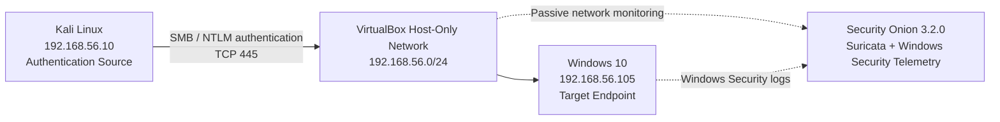

# Windows Authentication Attack Detection and Investigation

## Objective

Detect and investigate repeated failed Windows authentication attempts using Security Onion and Windows Security telemetry.

The goal of this project is to simulate controlled password-guessing activity against a Windows endpoint, identify the resulting authentication telemetry, determine the source and target of the activity, distinguish genuine credential failures from related authentication-processing events, determine whether any authentication attempts succeeded, and document the investigation from a SOC analyst perspective.

## Lab Environment

* Kali Linux — controlled activity generator
* Windows 10 — target endpoint
* Security Onion 3.2.0 — monitoring and investigation platform
* Suricata — network intrusion detection
* Windows Security Event Log — endpoint authentication telemetry
* VirtualBox — isolated lab environment

## Network Topology

The investigation was performed inside an isolated VirtualBox lab network. Kali Linux generated controlled SMB authentication attempts against the Windows 10 endpoint. Security Onion observed the SMB/NTLM network traffic with Suricata and also received Windows Security telemetry from the target endpoint.



## Scenario

A SOC analyst observes repeated Windows authentication failures associated with the internal source `192.168.56.10` and the Windows endpoint `192.168.56.105`.

The activity involves SMB/NTLM authentication against the local Windows account `labuser`. The objective of the investigation is to determine:

- which host initiated the authentication attempts
- which endpoint and account were targeted
- which authentication protocol and logon type were involved
- how many genuine credential failures occurred
- whether the raw Windows event count accurately represented the number of password guesses
- whether any authentication attempt succeeded
- whether the activity should be escalated in a real SOC environment

## Activity Simulation

Controlled password-guessing activity was generated from Kali Linux using NetExec against the Windows SMB service.

Command used:

```bash
for i in {1..5}; do nxc smb 192.168.56.105 -u labuser -p "WrongPass${i}x"; sleep 1; done
```

### Command Breakdown

- `for i in {1..5}` — repeats the authentication test five times
- `nxc smb` — uses NetExec to communicate with the target over SMB
- `192.168.56.105` — Windows target endpoint
- `-u labuser` — specifies the Windows account being tested
- `-p "WrongPass${i}x"` — supplies a different intentionally incorrect password for each attempt
- `sleep 1` — introduces a short delay between attempts

NetExec returned `STATUS_LOGON_FAILURE` for each authentication attempt, confirming that the supplied credentials were rejected.


## Detection

### Suricata NTLM Activity

Security Onion generated three Suricata alerts associated with the SMB/NTLM authentication exchange between the two lab hosts.

The alerts showed:

- source: `192.168.56.10`
- destination: `192.168.56.105`
- destination port: `445/TCP`
- `ET INFO NTLM Session Setup Request - Negotiate`
- `ET INFO NTLM Session Setup Request - Auth`
- `ET INFO NTLMv1 Session Setup Response - Challenge`

These alerts confirmed that NTLM authentication traffic was taking place over SMB. The alerts by themselves did not prove that authentication failed, so Windows Security telemetry was required for confirmation.


### Windows Event 4625 Detection

Security Onion Hunt was used to search Windows Security telemetry for failed logons on the Windows endpoint.

Query used:

```text
agent.name:"Victim" AND event.dataset:system.security AND event.code:4625
```

The query returned `10` Windows Event ID `4625` records during the activity period.

Event ID `4625` represents a failed Windows logon. At this stage, the raw count appeared to suggest ten failed authentication attempts. However, the controlled activity had only generated five password guesses, so the event count required further investigation rather than being accepted at face value.


## Investigation

### Detailed Failed Logon Analysis

One of the Event ID `4625` records associated with `labuser` was inspected in detail inside Security Onion.

The event showed:

- target account: `labuser`
- account domain: `Victim`
- Logon Type: `3`
- failure reason: `Unknown user name or bad password`
- status: `0xC000006D`
- substatus: `0xC000006A`
- source network address: `192.168.56.10`
- source port: `57132`
- logon process: `NtLmSsp`
- authentication package: `NTLM`

Logon Type `3` indicates a network logon, which is consistent with authentication over SMB rather than an interactive sign-in at the Windows console.

The source address also directly correlated the Windows authentication failure with the Kali Linux host used to generate the controlled activity.


### Authentication Failure Pattern

The Event ID `4625` telemetry was narrowed to events that matched all of the following:

- Windows endpoint `Victim`
- source IP `192.168.56.10`
- target account `labuser`
- Event ID `4625`

Query used:

```text
agent.name:"Victim" AND event.dataset:system.security AND event.code:4625 AND source.ip:"192.168.56.10" AND winlog.event_data.TargetUserName:"labuser"
```

The query returned exactly `5` matching events.

The failures occurred at approximately:

| Time | Result |
|---|---|
| 15:08:49.553 | Failed logon for `labuser` |
| 15:08:56.287 | Failed logon for `labuser` |
| 15:09:03.115 | Failed logon for `labuser` |
| 15:09:10.960 | Failed logon for `labuser` |
| 15:09:18.510 | Failed logon for `labuser` |

The repeated failures occurred in a regular pattern over roughly 29 seconds and all originated from the same source host against the same account. This is consistent with automated password guessing rather than an isolated authentication mistake.


### Why 10 Event 4625 Records Did Not Mean 10 Password Guesses

The initial Security Onion query returned `10` Event ID `4625` records, even though only five password guesses had been generated.

Further investigation showed that the records separated into two groups:

#### Five genuine credential failures

These events contained:

- `TargetUserName: labuser`
- source IP `192.168.56.10`
- failure reason `Unknown user name or bad password`
- status `0xC000006D`
- substatus `0xC000006A`

These five events corresponded directly to the five controlled password guesses.

#### Five additional authentication-processing failures

The remaining five Event ID `4625` records also originated from `192.168.56.10`, but they differed from the genuine credential failures:

- the target username field was blank
- the failure reason was `An Error occurred during Logon`
- status was `0x80090308`
- substatus was `0x0`
- authentication package was `NTLM`

Because these events did not identify `labuser` as the target account and used a different status value, they were treated as separate authentication-processing errors rather than additional password guesses.

This distinction was important because simply counting all Event ID `4625` records would have incorrectly doubled the number of password attempts from five to ten.

### Successful-vs-Failed Authentication Analysis

The next question was whether the repeated failures were followed by a successful authentication for `labuser`.

Security Onion was searched for Windows Event ID `4624`, which represents a successful logon, specifically targeting the same account.

Query used:

```text
agent.name:"Victim" AND event.dataset:system.security AND event.code:4624 AND winlog.event_data.TargetUserName:"labuser"
```

The query returned `0` events during the investigated attack window.

This means no successful Event ID `4624` logon for `labuser` was identified in the Security Onion telemetry during the period being investigated.


### Windows Endpoint Corroboration

To confirm the Security Onion findings directly on the endpoint, the Windows Security log was reviewed in Event Viewer.

A matching Event ID `4625` showed:

- account name: `labuser`
- account domain: `Victim`
- Logon Type: `3`
- failure reason: `Unknown user name or bad password`
- status: `0xC000006D`
- substatus: `0xC000006A`


The same event also showed:

- source network address: `192.168.56.10`
- source port: `57132`
- logon process: `NtLmSsp`
- authentication package: `NTLM`


This independently corroborated the Security Onion findings and confirmed that the target endpoint itself recorded the same network authentication failure from the Kali source.

### Endpoint Check for Successful Authentication

Windows Event Viewer was then filtered for Event ID `4624` during the same attack window and searched for the string `labuser`.

No matching event containing `labuser` was found in the filtered successful-logon records.

This endpoint-side result matched the Security Onion query and provided a second source of evidence that no successful `labuser` authentication was identified during the investigated time window.


## Incident Timeline

| Time | Event |
|---|---|
| ~15:08 | Controlled NetExec SMB password-guessing activity began from `192.168.56.10`. |
| 15:08:49.553 | First confirmed Event ID `4625` bad-password failure for `labuser`. |
| 15:08:56.287 | Second confirmed Event ID `4625` bad-password failure for `labuser`. |
| 15:09:03.115 | Third confirmed Event ID `4625` bad-password failure for `labuser`. |
| 15:09:10.960 | Fourth confirmed Event ID `4625` bad-password failure for `labuser`. |
| 15:09:18.510 | Fifth confirmed Event ID `4625` bad-password failure for `labuser`. |
| 15:05–15:11 | No successful Event ID `4624` logon for `labuser` was identified in the investigated window. |

## Indicators and Observables

| Type | Value | Role |
|---|---|---|
| Source IP | `192.168.56.10` | Host initiating the controlled authentication attempts |
| Destination IP | `192.168.56.105` | Windows target endpoint |
| Destination Port | `445/TCP` | SMB service used for authentication |
| Target Account | `labuser` | Account targeted by the password guesses |
| Windows Event ID | `4625` | Failed Windows logon |
| Successful Logon Event ID | `4624` | Searched to determine whether access succeeded |
| Logon Type | `3` | Network logon |
| Authentication Package | `NTLM` | Authentication mechanism observed |
| Logon Process | `NtLmSsp` | Windows NTLM logon process |
| Failure Status | `0xC000006D` | Status observed on genuine credential failures |
| Failure Substatus | `0xC000006A` | Substatus observed on genuine credential failures |
| Additional Error Status | `0x80090308` | Status observed on the five separate NTLM processing-error events |

## MITRE ATT&CK Mapping

### T1110.001 — Password Guessing

The activity maps to **T1110.001 — Password Guessing** because multiple passwords were attempted against the same Windows account over SMB/NTLM.

Evidence supporting this mapping:

- five different incorrect passwords were intentionally tested against `labuser`
- all five genuine credential failures originated from `192.168.56.10`
- the attempts targeted the same Windows endpoint `192.168.56.105`
- Windows recorded Event ID `4625` for each genuine password failure
- the attempts occurred repeatedly within a short and regular time period

The activity is more accurately described as password guessing than password spraying because multiple passwords were attempted against one account rather than one password being tested across many accounts.

## Findings and Analyst Verdict

The investigation found that `192.168.56.10` generated repeated SMB/NTLM authentication attempts against the Windows account `labuser` on `192.168.56.105`.

Key findings:

- NetExec generated five controlled authentication attempts using different incorrect passwords
- Security Onion observed SMB/NTLM traffic between the Kali and Windows hosts over TCP port `445`
- Security Onion initially returned 10 Windows Event ID `4625` records
- deeper analysis showed that only 5 of those records were genuine bad-password failures targeting `labuser`
- the other 5 Event ID `4625` records contained a blank target username and status `0x80090308`, so they were treated separately as authentication-processing errors
- the genuine password failures used Logon Type `3`, authentication package `NTLM`, and originated from `192.168.56.10`
- Windows Event Viewer independently corroborated the Security Onion findings
- no successful Event ID `4624` logon for `labuser` was identified in either Security Onion or the endpoint Security log during the investigated window
- the activity maps to MITRE ATT&CK `T1110.001 — Password Guessing`

The authentication detections are considered true positives because repeated password guessing genuinely occurred.

Within the investigated telemetry and time window, there was no evidence that the password guessing resulted in a successful authentication for `labuser`.

In a real SOC environment, repeated failed network logons from a single source against the same account should still be treated as suspicious until the source system and business context are validated. If the source were not an authorized administrative, security-testing, or vulnerability-management host, the activity should be escalated for further investigation.

## Recommendations and Remediation

In a real environment, the following actions would be appropriate:

- identify the asset and owner associated with the source IP `192.168.56.10`
- determine whether the authentication attempts were part of an approved administrative or security-testing activity
- review additional authentication telemetry for the targeted account before and after the observed failures
- monitor for successful Event ID `4624` logons following repeated Event ID `4625` failures
- review whether other accounts were targeted by the same source
- review endpoint and network telemetry for additional suspicious behavior associated with the source host
- if the source is unauthorized, consider temporarily isolating or blocking the source while the activity is investigated
- review the targeted account for signs of compromise and reset credentials if compromise is suspected
- verify whether account lockout, rate limiting, or other authentication protections are appropriately configured
- escalate the incident if successful authentication, lateral movement, privilege escalation, or other follow-on activity is identified

Detection logic should distinguish genuine credential failures from related authentication-processing errors where possible. Treating every Event ID `4625` as an independent password attempt can inflate counts and lead to inaccurate incident conclusions.

## What I Learned

<!-- Write this section in your own words. -->
